  

# Shain Gerstner

**Design Engineer — Thun, Switzerland**

I bridge vision and production: dev-ready systems, 3D, and motion for digital products that hold up once they ship. I get excited about making complicated things simple.

[**shain.ch**](https://shain.ch) &nbsp;·&nbsp; Founder of [.ARK Studio](https://shain.ch) &nbsp;·&nbsp; Currently open to Design Engineer roles & select freelance

---

### What I work on

- **Interaction & UX design** — turning fuzzy briefs into clear, usable systems
- **Design engineering** — building the thing, not just speccing it. Production frontends, design systems, and prototypes that survive contact with real code
- **3D & motion** — bringing weight and life to digital products
- **AI readiness** — helping Swiss KMUs adopt AI tooling without the hype

### Selected work

| Project | What it is |
| --- | --- |
| [**.ARK**](https://github.com/shainzen1/.ARK) | Studio site — Astro · React · TypeScript · Tailwind |
| [**offergenerator**](https://github.com/shainzen1/offergenerator) | Offer-generation tool for Drop In, a direct-booking platform for Costa Rica rentals |
| [**IAD-Interaktivitaet-Sem.4**](https://github.com/shainzen1/IAD-Interaktivitaet-Sem.4-prototype) | Interactive prototype from my Interaction Design studies |

More — Trauffer, Naturheilpraxis Nadja, and 3D/motion work — over at [shain.ch](https://shain.ch).

### Toolbox

**Design & motion** — Figma · Framer · Blender
**Build** — TypeScript · React · Astro · Tailwind CSS
**Workflow** — AI-assisted, design-to-production

### Reach me

[shain.ch](https://shain.ch) &nbsp;·&nbsp; based in Thun / Bern, building for clients worldwide
